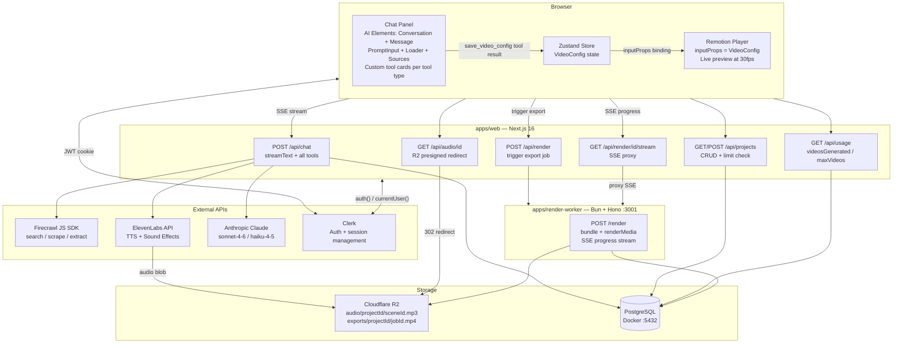
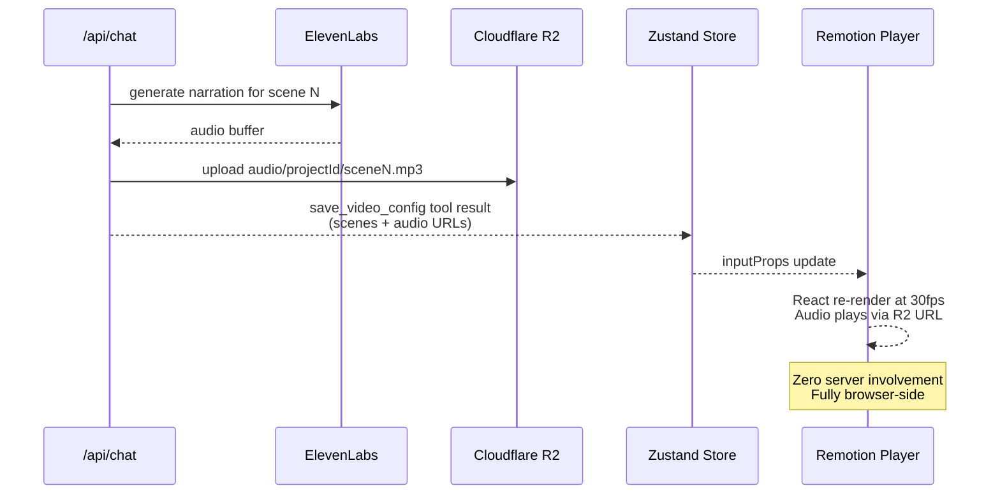
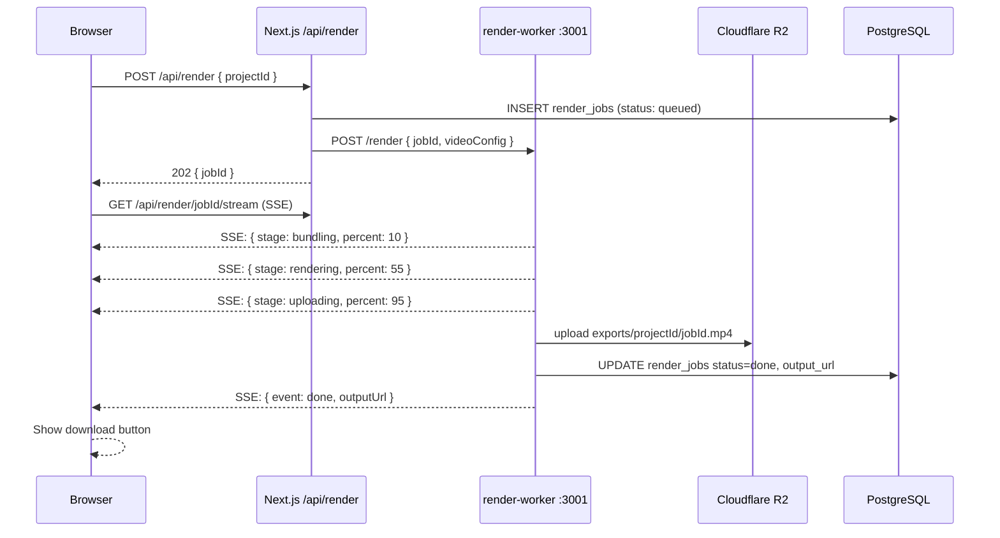
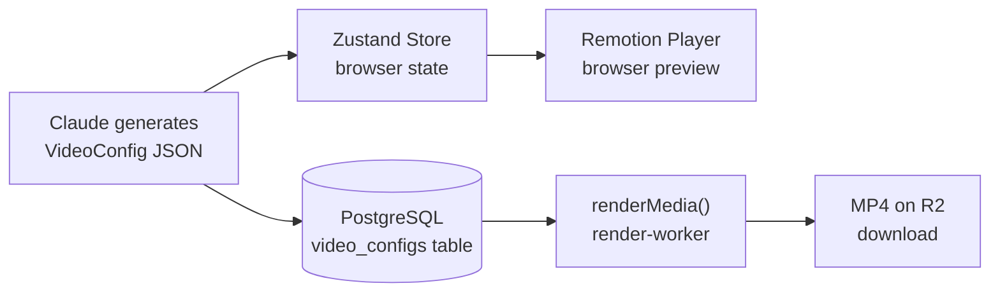
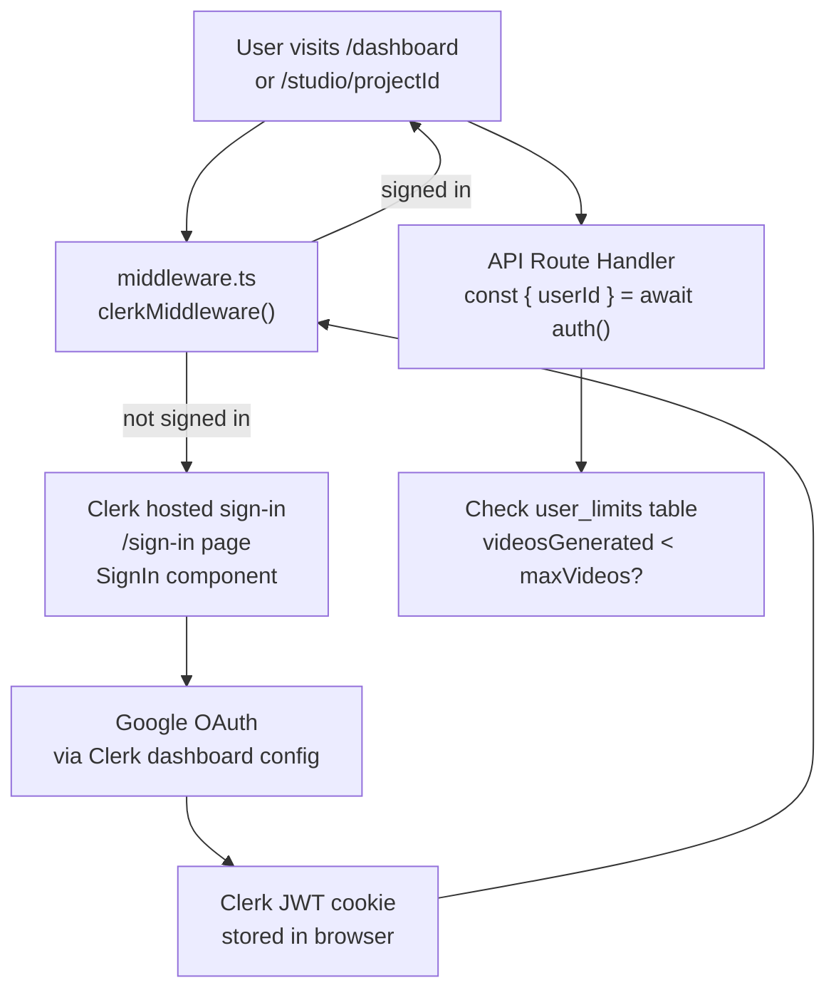
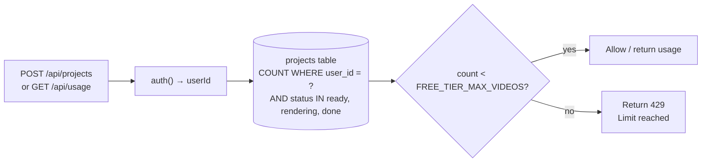

# Architecture

## Overview

Opencut is a full-stack TypeScript monorepo that lets users generate short-form social videos by chatting with an AI. The AI researches a topic via Firecrawl, writes a video script, generates narration and sound effects via ElevenLabs, and produces a live preview using Remotion Player — all in a single streaming chat turn. Users can iteratively refine the video through follow-up messages. Final exports are rendered server-side and stored on Cloudflare R2.

---

## Monorepo Structure

```
opencut/
├── apps/
│   ├── web/                        # Next.js 16 — main application
│   └── render-worker/              # Bun + Hono — video export service
├── packages/
│   └── types/                      # Shared Zod schemas + TypeScript types
├── docs/                           # This folder
├── docker-compose.yml
└── package.json                    # pnpm workspaces root
```

### `apps/web`

Next.js 16 application with App Router. Handles:
- All frontend UI (chat, live preview, project dashboard)
- All API route handlers (chat streaming, audio serving, project CRUD, render trigger)
- AI pipeline via AI SDK v6 `streamText` + custom tools
- Auth via Clerk with Google SSO — prebuilt UI components + server-side session helpers
- Database access via Drizzle ORM

### `apps/render-worker`

Bun + Hono service running on port `3001`. Handles:
- Remotion `bundle()` + `renderMedia()` — cannot run inside Next.js due to webpack conflict
- SSE stream of render progress percentage back to the caller
- Upload of final `.mp4` to Cloudflare R2 on completion

### `packages/types`

Shared Zod schemas and TypeScript types for `VideoConfig`, `Scene`, `AudioSegment`, `AspectRatio`, and `RenderJob`. Consumed by both `apps/web` and `apps/render-worker` to ensure the data contract is identical.

---

## System Architecture



---

## Live Preview vs Export Rendering

This is the most important architectural distinction.

### Live Preview — Runs entirely in the browser



The Remotion `<Player>` is a standard React component bundled with the Next.js app. When the AI's `save_video_config` tool writes to the Zustand store, React re-renders the Player immediately with the new config. Audio files are fetched directly from R2 via presigned URLs.

### Final Export — Runs in render-worker



---

## VideoConfig as Central Data Model

`VideoConfig` is the single source of truth for a video's content and structure. It flows through every layer of the system.



The config is pure JSON — no functions, no class instances — making it safely serializable across all service boundaries.

---

## Authentication Flow

Clerk handles all authentication. There are no local user tables in Postgres — Clerk manages user data in their cloud infrastructure.



Key points:
- `middleware.ts` (Next.js 16) uses `clerkMiddleware()` + `createRouteMatcher` to protect `/dashboard` and `/studio/*`
- `auth()` from `@clerk/nextjs/server` gives `userId` in any server component or route handler — no DB lookup needed
- `useUser()` hook in client components
- `<SignIn />`, `<SignUp />`, `<UserButton />` prebuilt components handle all UI
- Google OAuth configured entirely in the Clerk dashboard — no client ID/secret in app code

---

## Usage Limits

No separate table, no counters to maintain. The generation count is derived at query time by counting `projects` rows with terminal statuses for the current user. The cap is a single env var (`FREE_TIER_MAX_VIDEOS=5`).



**Why no `user_limits` table:** the count is always accurate since it reads live data — no counter drift, no upsert logic, no increment-on-completion. Changing the cap is one env var change.

---

## Streaming Architecture

All real-time communication uses SSE. No WebSockets, no polling.

| Stream | Source | Consumer |
|---|---|---|
| Chat + tool invocations | `/api/chat` via `toUIMessageStreamResponse()` | `useChat` hook |
| Render progress | render-worker SSE → proxied at `/api/render/[id]/stream` | `useRenderProgress` hook |

---

## Video Aspect Ratios

The AI picks from four presets based on user intent. Default is `9:16`.

| Key | Width | Height | Target |
|---|---|---|---|
| `9:16` | 1080 | 1920 | TikTok, Instagram Reels, YouTube Shorts (default) |
| `16:9` | 1920 | 1080 | YouTube, LinkedIn |
| `1:1` | 1080 | 1080 | Instagram square |
| `4:5` | 1080 | 1350 | Instagram portrait feed |

Scene layout templates have variants per aspect ratio, handled in the Remotion compositions.

---

## Cloudflare R2 Storage

R2 is used for two asset types, accessed via the AWS S3-compatible SDK (`@aws-sdk/client-s3`):

| Path | Content | Uploaded by | Accessed by |
|---|---|---|---|
| `audio/{projectId}/{sceneId}.mp3` | ElevenLabs TTS/SFX output | Next.js API during generation | Remotion Player (preview) + renderMedia (export) |
| `exports/{projectId}/{jobId}.mp4` | Final rendered video | render-worker after `renderMedia()` | User download link |

Audio files are uploaded immediately during generation so the Remotion Player can reference them by public URL in `VideoConfig.audioTrack.segments[].url`.
