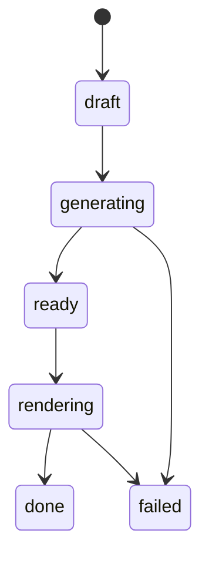
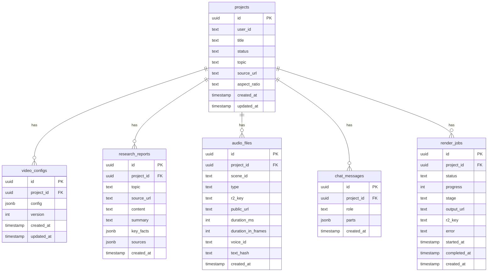

# Database

## Setup

- **Database:** PostgreSQL 16 (Docker)
- **ORM:** Drizzle ORM with `drizzle-kit@0.31.5`
- **Driver:** `postgres` (postgres.js)
- **Auth:** Clerk manages all user data in their cloud. No local auth tables. Clerk's `userId` (e.g. `user_2abc123`) is stored as a plain text column in app tables.

Schema lives in `apps/web/src/db/schema.ts`. Migrations live in `apps/web/drizzle/`.

---

## Schema

## Usage Limits

No separate table. The generation count is derived directly from the `projects` table by counting rows with terminal statuses (`ready`, `rendering`, `done`) for a given `userId`. The cap is a single env var.

```typescript
// apps/web/src/lib/limits.ts
import { db } from "@/db"
import { projects } from "@/db/schema"
import { and, eq, inArray, count } from "drizzle-orm"

const MAX_VIDEOS = parseInt(process.env.FREE_TIER_MAX_VIDEOS ?? "5")

export async function getUsage(userId: string) {
  const [row] = await db
    .select({ generated: count() })
    .from(projects)
    .where(
      and(
        eq(projects.userId, userId),
        inArray(projects.status, ["ready", "rendering", "done"])
      )
    )
  return {
    videosGenerated: row.generated,
    maxVideos: MAX_VIDEOS,
    canGenerate: row.generated < MAX_VIDEOS,
  }
}
```

**Why this is better than a separate `user_limits` table:**
- Always accurate — no counter drift if a job fails or retries
- No upsert on first use, no increment on completion
- Zero extra migrations
- Adjust the cap by changing one env var: `FREE_TIER_MAX_VIDEOS=10`

The `GET /api/usage` endpoint and the `POST /api/projects` limit check both call `getUsage(userId)`.

---

### `projects`

User-created video projects. One project = one video. `userId` is the Clerk user ID — no FK to a local users table since Clerk manages user data externally.

```typescript
export const projects = pgTable("projects", {
  id: uuid("id").defaultRandom().primaryKey(),
  userId: text("user_id").notNull(),               // Clerk userId — indexed, no FK constraint
  title: text("title").notNull(),
  status: text("status", {
    enum: ["draft", "generating", "ready", "rendering", "done", "failed"],
  }).notNull().default("draft"),
  topic: text("topic"),
  sourceUrl: text("source_url"),
  aspectRatio: text("aspect_ratio", {
    enum: ["9:16", "16:9", "1:1", "4:5"],
  }).notNull().default("9:16"),
  createdAt: timestamp("created_at").notNull().defaultNow(),
  updatedAt: timestamp("updated_at").notNull().defaultNow(),
}, (t) => [
  index("projects_user_id_idx").on(t.userId),
])
```

**Status lifecycle:**



---

### `video_configs`

The `VideoConfig` JSON for a project. Each edit creates a new version row — the highest `version` is current. Provides lightweight revision history.

```typescript
export const videoConfigs = pgTable("video_configs", {
  id: uuid("id").defaultRandom().primaryKey(),
  projectId: uuid("project_id").notNull()
    .references(() => projects.id, { onDelete: "cascade" }),
  config: jsonb("config").$type<VideoConfig>().notNull(),
  version: integer("version").notNull().default(1),
  createdAt: timestamp("created_at").notNull().defaultNow(),
  updatedAt: timestamp("updated_at").notNull().defaultNow(),
})
```

---

### `research_reports`

Cached Firecrawl research output per project. Reused when the user changes aspect ratio or video style without requesting new research.

```typescript
export const researchReports = pgTable("research_reports", {
  id: uuid("id").defaultRandom().primaryKey(),
  projectId: uuid("project_id").notNull()
    .references(() => projects.id, { onDelete: "cascade" }),
  topic: text("topic"),
  sourceUrl: text("source_url"),
  content: text("content").notNull(),
  summary: text("summary"),
  keyFacts: jsonb("key_facts").$type<string[]>(),
  sources: jsonb("sources").$type<{ url: string; title: string }[]>(),
  createdAt: timestamp("created_at").notNull().defaultNow(),
})
```

---

### `audio_files`

Metadata for every audio file generated for a project. Actual files are stored in Cloudflare R2.

```typescript
export const audioFiles = pgTable("audio_files", {
  id: uuid("id").defaultRandom().primaryKey(),
  projectId: uuid("project_id").notNull()
    .references(() => projects.id, { onDelete: "cascade" }),
  sceneId: text("scene_id").notNull(),
  type: text("type", { enum: ["narration", "sound_effect"] }).notNull(),
  r2Key: text("r2_key").notNull(),
  publicUrl: text("public_url").notNull(),
  durationMs: integer("duration_ms"),
  durationInFrames: integer("duration_in_frames"),
  voiceId: text("voice_id"),
  textHash: text("text_hash"),
  createdAt: timestamp("created_at").notNull().defaultNow(),
})
```

---

### `chat_messages`

Persisted conversation history per project. Loaded on each `/api/chat` request to give the LLM full context.

```typescript
export const chatMessages = pgTable("chat_messages", {
  id: uuid("id").defaultRandom().primaryKey(),
  projectId: uuid("project_id").notNull()
    .references(() => projects.id, { onDelete: "cascade" }),
  role: text("role", { enum: ["user", "assistant"] }).notNull(),
  parts: jsonb("parts").notNull(),
  createdAt: timestamp("created_at").notNull().defaultNow(),
})
```

---

### `render_jobs`

Tracks export render job state. One row per render attempt.

```typescript
export const renderJobs = pgTable("render_jobs", {
  id: uuid("id").defaultRandom().primaryKey(),
  projectId: uuid("project_id").notNull()
    .references(() => projects.id, { onDelete: "cascade" }),
  status: text("status", {
    enum: ["queued", "bundling", "rendering", "uploading", "done", "failed"],
  }).notNull().default("queued"),
  progress: integer("progress").notNull().default(0),
  stage: text("stage"),
  outputUrl: text("output_url"),
  r2Key: text("r2_key"),
  error: text("error"),
  startedAt: timestamp("started_at"),
  completedAt: timestamp("completed_at"),
  createdAt: timestamp("created_at").notNull().defaultNow(),
})
```

---

## Relations

```typescript
export const projectsRelations = relations(projects, ({ many }) => ({
  videoConfigs: many(videoConfigs),
  researchReports: many(researchReports),
  audioFiles: many(audioFiles),
  chatMessages: many(chatMessages),
  renderJobs: many(renderJobs),
}))

export const videoConfigsRelations = relations(videoConfigs, ({ one }) => ({
  project: one(projects, { fields: [videoConfigs.projectId], references: [projects.id] }),
}))

export const audioFilesRelations = relations(audioFiles, ({ one }) => ({
  project: one(projects, { fields: [audioFiles.projectId], references: [projects.id] }),
}))

export const chatMessagesRelations = relations(chatMessages, ({ one }) => ({
  project: one(projects, { fields: [chatMessages.projectId], references: [projects.id] }),
}))

export const renderJobsRelations = relations(renderJobs, ({ one }) => ({
  project: one(projects, { fields: [renderJobs.projectId], references: [projects.id] }),
}))
```

---

## Entity Relationship Diagram



`projects.user_id` is a Clerk user ID — no FK constraint since Clerk manages the authoritative user record externally. The generation count for limit checking is derived at query time via `COUNT(*)` on this column.

---

## Drizzle Config

`apps/web/drizzle.config.ts`:

```typescript
import { defineConfig } from "drizzle-kit"

export default defineConfig({
  schema: "./src/db/schema.ts",
  out: "./drizzle",
  dialect: "postgresql",
  dbCredentials: {
    url: process.env.DATABASE_URL!,
  },
  casing: "snake_case",
})
```

---

## Clerk + Drizzle Integration

Clerk manages all auth state. The app only needs the Clerk `userId` to associate records.

`apps/web/src/lib/auth.ts`:

```typescript
import { auth } from "@clerk/nextjs/server"

// Use in any server component or route handler
export async function requireAuth() {
  const { userId } = await auth()
  if (!userId) throw new Error("Unauthorized")
  return userId
}
```

---

## Commands

```bash
# Generate Drizzle migration after schema changes
pnpm --filter web drizzle-kit generate

# Apply migrations
pnpm --filter web drizzle-kit migrate

# Open Drizzle Studio
pnpm --filter web drizzle-kit studio
```
