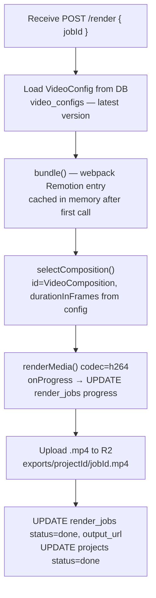

# API Reference

All Next.js API routes live under `apps/web/app/api/`. All render-worker routes live in `apps/render-worker/src/`.

---

## Next.js API Routes

### `POST /api/chat`

Main AI streaming endpoint. Accepts a chat message, loads the current project state and chat history, and runs `streamText` with the full generation pipeline tools. Returns an SSE stream compatible with AI SDK v6's `useChat` hook.

**Request body**
```json
{
  "messages": [UIMessage],
  "projectId": "uuid"
}
```

**Response** — `text/event-stream` via `toUIMessageStreamResponse()`

The stream emits:
- Text deltas (assistant narrating progress)
- Tool call start / result events (shown as tool call cards in the chat panel)
- Final `finish` event

**Tool invocation order**

| Phase | Tools invoked |
|---|---|
| New video | `research_topic` → `generate_narration` ×N → `generate_image` ×M (optional) → `generate_video_code` → `save_video_code` |
| Follow-up edit | Same pipeline — full regeneration with updated requirements |

**Notes**
- `stopWhen: stepCountIs(25)` allows up to 25 sequential tool calls per request
- Conversation history is loaded from `chat_messages` table on each request
- Current `VideoConfig` (if any) is injected into the system prompt
- `onFinish` converts tool-call parts to `dynamic-tool` state before saving to DB so tool states restore correctly on refresh

---

### `GET /api/projects`

List all projects for the authenticated user, ordered by `updated_at` descending.

**Response**
```json
[
  {
    "id": "uuid",
    "title": "string",
    "status": "draft | generating | ready | rendering | done",
    "topic": "string | null",
    "sourceUrl": "string | null",
    "aspectRatio": "9:16 | 16:9 | 1:1 | 4:5",
    "createdAt": "ISO8601",
    "updatedAt": "ISO8601"
  }
]
```

---

### `POST /api/projects`

Create a new empty project. Counts the user's total projects and returns `429` if the count reaches `FREE_TIER_MAX_PROJECTS`. Also checks `FREE_TIER_MAX_MESSAGES` against `chat_messages`.

**Request body**
```json
{
  "title": "string",
  "topic": "string (optional)",
  "sourceUrl": "string (optional)",
  "aspectRatio": "9:16 | 16:9 | 1:1 | 4:5 (default: 9:16)"
}
```

**Response** — `201 Created`
```json
{
  "id": "uuid",
  "title": "string",
  "status": "draft",
  "createdAt": "ISO8601"
}
```

**Error** — `429 Too Many Requests`
```json
{
  "error": "Project limit reached. You have 5 of 5 allowed projects.",
  "code": "LIMIT_REACHED"
}
```

---

### `GET /api/projects/[id]`

Get a single project including its current `VideoConfig` and full chat message history.

**Response**
```json
{
  "project": { "id", "title", "status", "aspectRatio", "topic", "sourceUrl", "createdAt", "updatedAt" },
  "config": VideoConfig | null,
  "messages": [UIMessage]
}
```

`VideoConfig` shape:
```json
{
  "id": "uuid",
  "title": "string",
  "aspectRatio": "9:16",
  "fps": 30,
  "durationInFrames": 450,
  "code": "export const VideoContent = () => { ... };"
}
```

---

### `PUT /api/projects/[id]`

Update project metadata (title, status). Does not update the VideoConfig — that is handled by the `save_video_code` tool.

**Request body**
```json
{
  "title": "string?",
  "status": "draft | generating | ready | rendering | done?"
}
```

**Response** — updated project object.

---

### `DELETE /api/projects/[id]`

Delete a project and all associated data (video config, audio files metadata, render jobs, chat messages). R2 objects (audio, images, exports) are also deleted via the S3 client.

**Response** — `204 No Content`

---

### `POST /api/projects/[id]/export`

Trigger an export render job. Creates a `render_jobs` row with status `queued`, calls the render-worker's `POST /render` (fire-and-forget), and returns immediately.

Returns the existing in-progress job if one is already running.

**Response** — `202 Accepted`
```json
{
  "id": "uuid",
  "projectId": "uuid",
  "status": "queued",
  "progress": 0,
  "stage": null,
  "outputUrl": null,
  "error": null,
  "createdAt": "ISO8601"
}
```

**Error** — `409 Conflict` if the project is still generating.

---

### `GET /api/projects/[id]/render-job`

Get the latest render job for a project. Used by `VideoPreviewPanel` on a 2.5 s polling interval to track export progress.

**Response** — latest `render_jobs` row (same shape as above, with `outputUrl` populated when `status === "done"`).

Returns `404` if no render job exists yet.

---

### `GET /api/projects/[id]/download`

Server-side proxy that streams the exported MP4 from R2 to the browser, forcing a file download. Used instead of linking directly to R2 to work around CORS and browser `download` attribute limitations for cross-origin URLs.

**Response** — streamed MP4 with headers:
```
Content-Type: video/mp4
Content-Disposition: attachment; filename="opencut-export.mp4"
```

---

### `GET /api/usage`

Return the authenticated user's current usage against their tier limits.

**Response**
```json
{
  "projects": { "used": 3, "max": 5 },
  "renders": { "used": 1, "max": 10 },
  "messages": { "used": 12, "max": 50 }
}
```

Returns `401` if not signed in.

---

### Auth — Clerk

Clerk handles all authentication. There is no `/api/auth` route in this app.

| Layer | How |
|---|---|
| Route protection | `proxy.ts` — `clerkMiddleware()` + `createRouteMatcher(['/dashboard(.*)', '/studio(.*)'])` |
| Server components / route handlers | `const { userId } = await auth()` from `@clerk/nextjs/server` |
| Client components | `const { user, isSignedIn } = useUser()` from `@clerk/nextjs` |
| Sign-in page | `/sign-in` — renders Clerk `<SignIn />` component |
| Sign-up page | `/sign-up` — renders Clerk `<SignUp />` component |
| Header user button | `<UserButton />` component |

`proxy.ts` (Next.js 16 equivalent of `middleware.ts`):

```typescript
import { clerkMiddleware, createRouteMatcher } from "@clerk/nextjs/server"

const isProtected = createRouteMatcher(["/dashboard(.*)", "/studio(.*)"])

export default clerkMiddleware(async (auth, req) => {
  if (isProtected(req)) await auth.protect()
})
```

---

## Render Worker Routes (Bun + Hono, port 8787)

Internal service — not exposed to the browser. Called only by Next.js API routes.
All endpoints require `x-render-secret` header matching `RENDER_WORKER_SECRET` env var.

---

### `GET /`

Health check.

**Response** — `200 OK`
```json
{ "status": "ok", "service": "opencut-render-worker" }
```

---

### `POST /render`

Start a render job asynchronously. The worker runs `bundle() → selectComposition() → renderMedia() → R2 upload` in the background and updates the DB row at each stage.

**Request body**
```json
{ "jobId": "uuid" }
```

**Response** — `200 OK` (immediate — job runs in background)
```json
{ "jobId": "uuid", "status": "queued" }
```

**Internal process**



---

## Shared Types

All request/response types that cross service boundaries are defined in `packages/types/src/index.ts`.

```typescript
VideoConfig      // { id, title, aspectRatio, fps, durationInFrames, code }
AudioAsset       // { id, url, durationMs, durationInFrames, text }
ImageAsset       // { id, url }
AspectRatio      // "9:16" | "16:9" | "1:1" | "4:5"
RenderJobStatus  // "queued" | "bundling" | "rendering" | "uploading" | "done" | "failed"
```

---

## Error Handling

All API routes return consistent error shapes:

```json
{
  "error": "string",
  "code": "UNAUTHORIZED | NOT_FOUND | VALIDATION_ERROR | LIMIT_REACHED | INTERNAL_ERROR"
}
```

HTTP status codes: `400` validation, `401` unauthorized, `404` not found, `429` limit reached, `500` internal.

Client-side errors from the AI chat stream, export failures, and download failures are shown as Sonner toast notifications.
