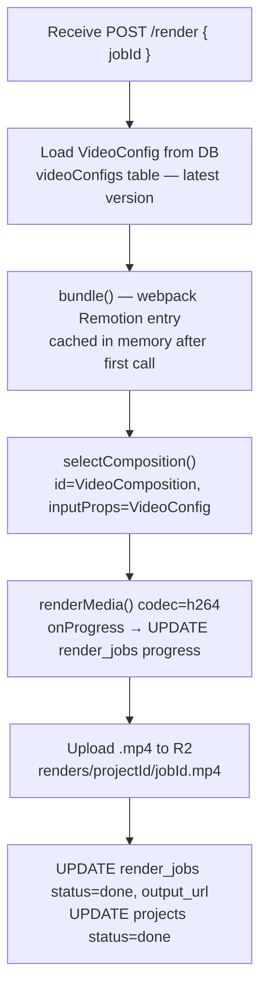

# API Reference

All Next.js API routes live under `apps/web/app/api/`. All render-worker routes live in `apps/render-worker/src/`.

---

## Next.js API Routes

### `POST /api/chat`

Main AI streaming endpoint. Accepts a chat message, loads the current project state, and runs `streamText` with Firecrawl + video production tools. Returns an SSE stream compatible with AI SDK v6's `useChat` hook.

**Request body**
```json
{
  "messages": [UIMessage],
  "projectId": "uuid"
}
```

**Response**
`text/event-stream` — AI SDK UI message stream (`toUIMessageStreamResponse()`).

The stream emits:
- Text deltas (assistant thinking/narrating)
- Tool call start events (shows tool name + input in the chat panel)
- Tool result events (shows tool output in the chat panel)
- Final `finish` event

**Behavior by message type**

| User message pattern | Tools invoked |
|---|---|
| New topic / URL | `research_topic` → `generate_video_script` → `generate_audio_segment` × N → `save_video_config` |
| "Change text/data in scene X" | `patch_scene` |
| "Change narration in scene X" | `regenerate_audio_segment` |

**Notes**
- Conversation history is loaded from `chat_messages` table on each request.
- Current `VideoConfig` is injected into the system prompt so the LLM can reference existing scenes without re-generating everything.
- Firecrawl MCP client is initialized per-request and closed in `onFinish`.
- The model is selected via `getGenerationModel()` / `getEditModel()` from `src/lib/ai/model.ts`. Provider and model names are configurable via `AI_PROVIDER`, `AI_GENERATION_MODEL`, `AI_EDIT_MODEL` env vars.

---

### `GET /api/projects`

List all projects for the authenticated user, ordered by `updated_at` descending.

**Response**
```json
[
  {
    "id": "uuid",
    "title": "string",
    "status": "draft | generating | ready | rendering | done",
    "topic": "string | null",
    "sourceUrl": "string | null",
    "createdAt": "ISO8601",
    "updatedAt": "ISO8601"
  }
]
```

---

### `POST /api/projects`

Create a new empty project. Counts the user's projects with terminal statuses (`ready`, `rendering`, `done`) — returns `429` if the count reaches `FREE_TIER_MAX_VIDEOS`. No separate limits table exists; the cap is derived live from the `projects` table.

**Request body**
```json
{
  "title": "string",
  "topic": "string (optional)",
  "sourceUrl": "string (optional)",
  "aspectRatio": "9:16 | 16:9 | 1:1 | 4:5 (default: 9:16)"
}
```

**Response** — `201 Created`
```json
{
  "id": "uuid",
  "title": "string",
  "status": "draft",
  "createdAt": "ISO8601"
}
```

**Error** — `429 Too Many Requests`
```json
{
  "error": "You have reached the free tier limit of 5 videos.",
  "code": "LIMIT_REACHED",
  "videosGenerated": 5,
  "maxVideos": 5
}
```

---

### `GET /api/projects/[id]`

Get a single project including its current `VideoConfig` and full chat message history.

**Response**
```json
{
  "project": { "id", "title", "status", "aspectRatio", "topic", "sourceUrl", "createdAt", "updatedAt" },
  "config": VideoConfig | null,
  "messages": [UIMessage]
}
```

> **Next.js 16 note:** `params` is async. Route handler must `await params` before accessing `id`.

---

### `PUT /api/projects/[id]`

Update project metadata (title, status). Does not update the VideoConfig — that is handled by `save_video_config` tool.

**Request body**
```json
{
  "title": "string?",
  "status": "draft | generating | ready | rendering | done?"
}
```

**Response** — updated project object.

---

### `DELETE /api/projects/[id]`

Delete a project and all associated data (video config, audio files metadata, render jobs, chat messages). R2 objects are also deleted via the S3 client.

**Response** — `204 No Content`

---

### `GET /api/audio/[id]`

Redirect to a short-lived Cloudflare R2 presigned URL for the audio file. Presigned URL expires in 1 hour. This keeps R2 credentials server-side while still allowing Remotion Player and renderMedia to fetch audio from R2.

**Response** — `302 Redirect` to presigned R2 URL.

---

### `POST /api/projects/[id]/export`

Trigger an export render job for a project. Creates a `render_jobs` row with status `queued`, calls the render-worker's `POST /render` endpoint (fire-and-forget), and returns immediately.

Returns the existing in-progress job if one is already running.

**Response** — `202 Accepted` — the full `render_jobs` row.

```json
{
  "id": "uuid",
  "projectId": "uuid",
  "status": "queued",
  "progress": 0,
  "stage": null,
  "outputUrl": null,
  "error": null,
  "createdAt": "ISO8601"
}
```

**Error** — `409 Conflict` if the project is still generating.

---

### `GET /api/projects/[id]/render-job`

Poll the latest render job for a project. Used by `VideoPreviewPanel` on a 2.5 s interval.

**Response** — latest `render_jobs` row (same shape as above, with `outputUrl` populated when `status === "done"`).

Returns `404` if no render job exists yet.

---

### `GET /api/usage`

Return the authenticated user's current generation usage against their tier limit. Used by the dashboard and studio to show the usage indicator and gate the "New video" button.

**Response**
```json
{
  "videosGenerated": 3,
  "maxVideos": 5,
  "tier": "free",
  "canGenerate": true
}
```

Returns `401` if not signed in.

---

### Auth — Clerk

Clerk handles all authentication. There is no `/api/auth` route in this app. Clerk's integration points are:

| Layer | How |
|---|---|
| Route protection | `proxy.ts` — `clerkMiddleware()` + `createRouteMatcher(['/dashboard(.*)', '/studio(.*)'])` |
| Server components / route handlers | `const { userId } = await auth()` from `@clerk/nextjs/server` |
| Client components | `const { user } = useUser()` from `@clerk/nextjs` |
| Sign-in page | `/sign-in` — renders Clerk `<SignIn />` component |
| Sign-up page | `/sign-up` — renders Clerk `<SignUp />` component |
| Header user button | `<UserButton />` component |

Google OAuth is configured entirely inside the Clerk dashboard — no client ID/secret needed in app environment variables.

`proxy.ts` (Next.js 16 replacement for `middleware.ts`):

```typescript
import { clerkMiddleware, createRouteMatcher } from "@clerk/nextjs/server"

const isProtected = createRouteMatcher(["/dashboard(.*)", "/studio(.*)"])

export default clerkMiddleware(async (auth, req) => {
  if (isProtected(req)) await auth.protect()
})

export const config = {
  matcher: [
    "/((?!_next|[^?]*\\.(?:html?|css|js(?!on)|jpe?g|webp|png|gif|svg|ttf|woff2?|ico|csv|docx?|xlsx?|zip|webmanifest)).*)",
    "/(api|trpc)(.*)",
  ],
}
```

---

## Render Worker Routes (Bun + Hono, port 8787)

Internal service — not exposed to the browser directly. Called only by Next.js API routes.
All endpoints require `x-render-secret` header matching `RENDER_WORKER_SECRET` env var.

---

### `GET /`

Health check.

**Response** — `200 OK`
```json
{ "status": "ok", "service": "opencut-render-worker" }
```

---

### `POST /render`

Start a render job asynchronously. Next.js creates the `render_jobs` DB row first, then calls this with the `jobId`. The worker runs `bundle() → selectComposition() → renderMedia() → R2 upload` in the background and updates the DB row at each stage.

**Request body**
```json
{ "jobId": "uuid" }
```

**Response** — `200 OK` (immediate — job runs in background)
```json
{ "jobId": "uuid", "status": "queued" }
```

**Internal process**



---

### `GET /jobs/:jobId`

Get a single render job by ID. Used as an alternative to polling the Next.js API.

**Response** — `render_jobs` row.

---

## Shared Types

All request/response types that cross service boundaries are defined in `packages/types/src/index.ts` and validated with Zod. Key exported types:

```typescript
VideoConfig        // Full video config passed to Player and renderMedia
Scene              // Union type of all scene variants
AudioSegment       // Audio track segment with R2 URL + frame offset
AspectRatio        // "9:16" | "16:9" | "1:1" | "4:5"
RenderJobStatus    // "queued" | "bundling" | "rendering" | "uploading" | "done" | "failed"
ResearchReport     // Synthesized research output from Firecrawl
```

---

## Error Handling

All API routes return consistent error shapes:

```json
{
  "error": "string",
  "code": "UNAUTHORIZED | NOT_FOUND | VALIDATION_ERROR | INTERNAL_ERROR"
}
```

HTTP status codes: `400` validation, `401` unauthorized, `404` not found, `500` internal.

Streaming routes (`/api/chat`, `/api/render/[id]/stream`) emit an `error` SSE event on failure rather than returning an HTTP error code, since the stream header has already been sent.
