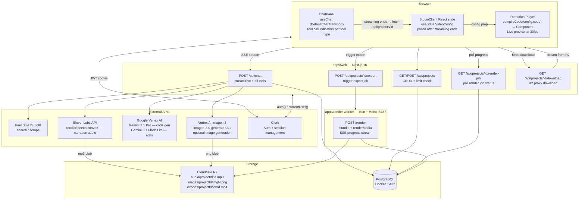
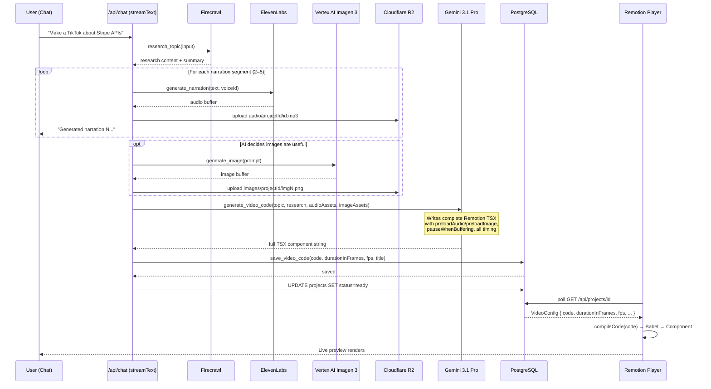
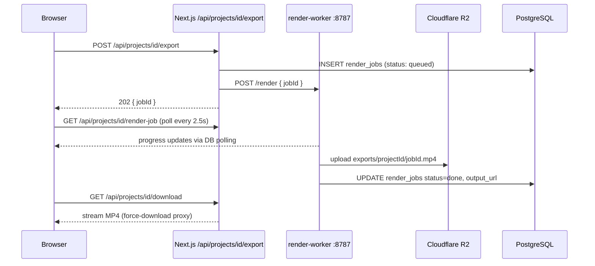
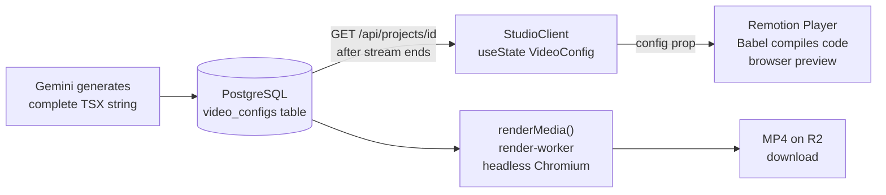
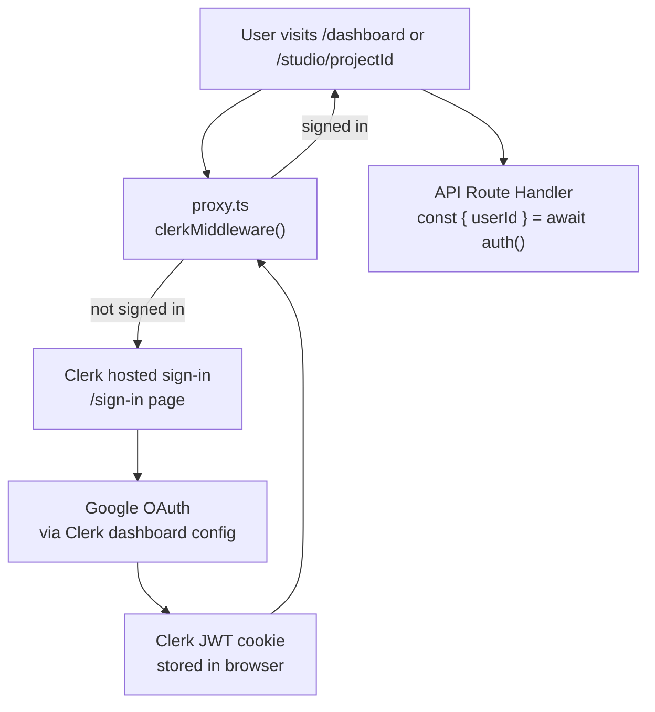
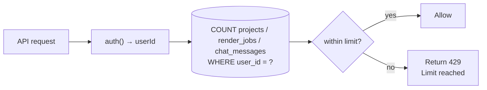

# Architecture

## Overview

Opencut is a full-stack TypeScript monorepo that lets users generate short-form social videos by chatting with an AI. The AI researches a topic via Firecrawl, generates narration audio via ElevenLabs, optionally generates images via Vertex AI Imagen 3, and then writes a **complete Remotion React component from scratch** as a TypeScript string. That string is compiled in the browser with `@babel/standalone` and rendered live by the Remotion Player — no hardcoded templates, no fixed scene structure.

Key differentiator: the AI has full creative freedom over every visual element, animation, timing, and layout. It can generate viral-style TikTok hooks, Fireship-style tutorial sequences, or anything else — the output style is entirely AI-determined.

---

## Monorepo Structure

```
opencut/
├── apps/
│   ├── web/                        # Next.js 16 — main application
│   └── render-worker/              # Bun + Hono — video export service
├── packages/
│   └── types/                      # Shared Zod schemas + TypeScript types
├── docs/                           # This folder
├── docker-compose.yml
└── package.json                    # pnpm workspaces root
```

### `apps/web`

Next.js 16 application with App Router. Handles:
- All frontend UI (chat, live preview, project dashboard)
- All API route handlers (chat streaming, project CRUD, render trigger)
- AI pipeline via AI SDK v6 `streamText` + custom tools
- Client-side Babel compilation of AI-generated Remotion TSX (`src/remotion/compiler.ts`)
- Auth via Clerk with Google SSO
- Database access via Drizzle ORM

### `apps/render-worker`

Bun + Hono service running on port `8787`. Handles:
- Remotion `bundle()` + `renderMedia()` — must run outside Next.js to avoid webpack conflicts
- Bundle is cached in-process after the first call for fast subsequent renders
- Progress updates written directly to `render_jobs` table (polled by the browser via Next.js)
- Upload of final `.mp4` to Cloudflare R2 on completion
- Authentication via shared `RENDER_WORKER_SECRET` header

### `packages/types`

Shared Zod schemas and TypeScript types. The core `VideoConfig` schema contains:
- `id`, `title`, `aspectRatio`, `fps`, `durationInFrames`
- `code` — the complete AI-generated Remotion TSX component as a raw string

Also exports `AudioAsset` and `ImageAsset` interfaces used during the generation pipeline.

---

## System Architecture



---

## AI Generation Pipeline



---

## Live Preview — Runs entirely in the browser

The Remotion `<Player>` is a standard React component bundled with the Next.js app. When `save_video_code` sets `status = ready`, `StudioClient` polls `GET /api/projects/[id]` and calls `setConfig()`. The `VideoComposition` component:

1. Receives `VideoConfig` as `inputProps` from the Player
2. Calls `compileCode(config.code)` (memoized) from `src/remotion/compiler.ts`
3. `compiler.ts` uses `@babel/standalone` to transpile the TSX string into plain JS
4. The compiled function is executed via `new Function(...)` with Remotion globals injected
5. The resulting React component is rendered directly

**Injected globals** (no imports needed in generated code):
- Remotion core: `useCurrentFrame`, `useVideoConfig`, `AbsoluteFill`, `Sequence`, `Audio`, `Img`, `spring`, `interpolate`
- Preloading: `preloadAudio`, `preloadImage` (from `@remotion/preload`)
- Shapes: `Rect`, `Circle`, `Triangle`, `Star`, `Polygon`, `Ellipse`, `Heart`, `Pie`
- Transitions: `TransitionSeries`, `linearTiming`, `springTiming`, `fade`, `slide`, `wipe`, `flip`, `clockWipe`
- React hooks: `useState`, `useEffect`, `useMemo`, `useRef`

---

## Final Export — Runs in render-worker



The render-worker runs the same Remotion composition in a headless Chromium instance. The `VideoComposition` component is bundled by `@remotion/bundler`, and the AI-generated `code` string goes through the same Babel compilation path as the live preview.

---

## VideoConfig — Central Data Model



The config is pure JSON — safely serializable across all service boundaries.

```typescript
// packages/types/src/index.ts
export const VideoConfigSchema = z.object({
  id: z.string(),
  title: z.string(),
  aspectRatio: z.enum(["9:16", "16:9", "1:1", "4:5"]),
  fps: z.number().default(30),
  durationInFrames: z.number(),
  code: z.string().describe("Complete Remotion TSX component source code"),
})
```

---

## Authentication Flow



- `proxy.ts` (Next.js 16) uses `clerkMiddleware()` + `createRouteMatcher` to protect `/dashboard` and `/studio/*`
- `auth()` from `@clerk/nextjs/server` gives `userId` in any server component or route handler
- Google OAuth configured entirely in the Clerk dashboard — no client ID/secret in app code

---

## Usage Limits

No separate table, no counters to maintain. Limits are derived at query time by counting rows.



| Resource | Table counted | Env var |
|---|---|---|
| Projects | `projects` (any status) | `FREE_TIER_MAX_PROJECTS=5` |
| Render exports | `render_jobs` (any status) | `FREE_TIER_MAX_RENDERS=10` |
| Chat messages | `chat_messages` (user role) | `FREE_TIER_MAX_MESSAGES=50` |

---

## Cloudflare R2 Storage

R2 is used for three asset types, accessed via the AWS S3-compatible SDK.

| Path | Content | Uploaded by | Accessed by |
|---|---|---|---|
| `audio/{projectId}/{id}.mp3` | ElevenLabs TTS narration | Next.js API during generation | Remotion Player + renderMedia |
| `images/{projectId}/{name}.png` | Vertex AI Imagen 3 output | Next.js API during generation | Remotion Player + renderMedia |
| `exports/{projectId}/{jobId}.mp4` | Final rendered video | render-worker after `renderMedia()` | `/api/projects/[id]/download` proxy |

**CORS required:** The R2 bucket must have a CORS policy allowing `GET` and `HEAD` from any origin, otherwise the browser cannot load audio and image assets for the Remotion Player.

---

## Streaming Architecture

All real-time communication uses SSE. No WebSockets, no polling on the chat stream.

| Stream | Source | Consumer |
|---|---|---|
| Chat + tool invocations | `/api/chat` via `toUIMessageStreamResponse()` | `useChat` hook |
| Render progress | DB polling at 2.5 s intervals | `VideoPreviewPanel` |

---

## Video Aspect Ratios

| Key | Width | Height | Target |
|---|---|---|---|
| `9:16` | 1080 | 1920 | TikTok, Instagram Reels, YouTube Shorts (default) |
| `16:9` | 1920 | 1080 | YouTube, LinkedIn |
| `1:1` | 1080 | 1080 | Instagram square |
| `4:5` | 1080 | 1350 | Instagram portrait feed |
